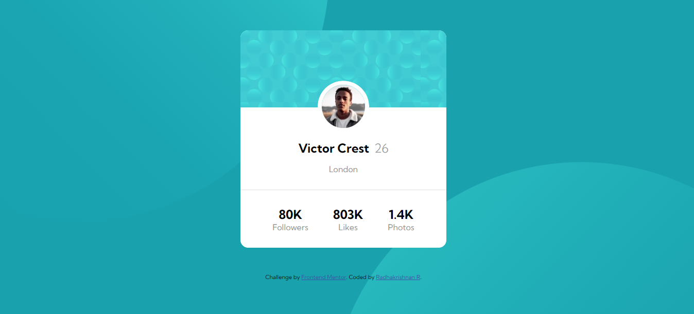

# Frontend Mentor - Profile card component solution

This is a solution to the [Profile card component challenge on Frontend Mentor](https://www.frontendmentor.io/challenges/profile-card-component-cfArpWshJ). Frontend Mentor challenges help you improve your coding skills by building realistic projects. 

## Table of contents

- [Overview](#overview)
  - [The challenge](#the-challenge)
  - [Screenshot](#screenshot)
  - [Links](#links)
- [My process](#my-process)
  - [Built with](#built-with)
  - [What I learned](#what-i-learned)
- [Author](#author)


## Overview

### The challenge

- Build out the project to the designs provided

### Screenshot




### Links

- Solution URL: 
- Live Site URL: 

## My process

### Built with

- Semantic HTML5 markup
- CSS custom properties
- Flexbox
- Mobile-first workflow


### What I learned

It was great exercise to learn more about background postioning and so.

```css
  body{
    font-family: "Kumbh Sans", sans-serif;
    display: flex;
    flex-direction: column;
    justify-content: center;
    align-items: center;
    height: 100vh;
    background-color: hsl(185, 75%, 39%);
    /* background-image: url("./images/bg-pattern-top.svg"); */
    background-image: url("./images/bg-pattern-top.svg"), url("./images/bg-pattern-bottom.svg");
    background-repeat: no-repeat, no-repeat;
    background-position: right 52vw bottom 30vh, left 48vw top 52vh;
    
}

```

## Author

- Website - [Radhakrishnan R](https://radhakrishnans-portfolio.webflow.io/)
- Frontend Mentor - [Radhakrishnan-R](https://www.frontendmentor.io/profile/Radhakrishnan-R)

